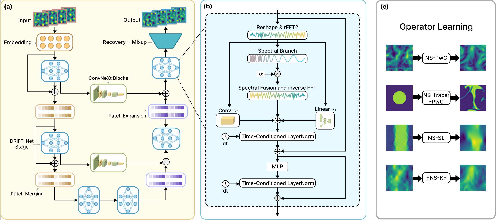

# DRIFT-Net: A Spectral--Coupled Neural Operator for PDEs Learning  

> DRIFT-Net: A Spectral--Coupled Neural Operator for PDEs Learning  
> ICLR 2026 Poster  
> Jiayi Li, Flora D. Salim  
> Paper: https://arxiv.org/abs/2509.24868  

DRIFT-Net is a Spectral--Coupled Neural Operator for efficient PDE forecasting. The architecture couples a spectral branch with an image branch and fuses them per scale for stable long-horizon rollouts.

<p align="center">
  
</p>

## APEBench Kolmogorov flow regimes for long-horizon autoregressive forecasting

We evaluate DRIFT-Net on two high-resolution regimes of the 2D Kolmogorov flow from APEBench under long-horizon autoregressive rollouts, where the model is trained for one-step prediction and iteratively applied for many steps. This setting is challenging because small phase and amplitude errors can accumulate over time, and high-frequency artifacts may destabilize the rollout.

<p align="center">
  
  
</p>

<p align="center">
Left: turbulent variant with stronger small-scale structures. Right: smoother variant with weaker small-scale content. We report long-horizon rollout quality on both regimes to assess stability and robustness across different spectral characteristics.
</p>

## Comparison with POSEIDON SCOT baseline

We compare **DRIFT-Net** with the POSEIDON SCOT baseline under identical training and evaluation settings. All models are trained for one-step prediction and evaluated via long-horizon autoregressive rollout.

<p align="center">
  
</p>

All panels correspond to the same rollout trajectory and share the same spatial resolution and color scale. The animation shows ground truth, SCOT prediction, and DRIFT-Net prediction side by side under a consistent protocol.


## Usage

### Installation & Requirements

To get all requirements and install the package, run (inside this folder), after getting this repository:

```bash
pip install -e .
```

We recommend running the above command in a [virtual environment](https://docs.python.org/3/library/venv.html).

After installation, you can import the models and use the training and inference scripts from everywhere on your system.

### Using the models in your own code

To use the models in your own code, you can use the following code snippet (after installing):

```python
from driftnet.model import DriftNet

model = DriftNet.from_pretrained("<MODEL_PATH>")
```

This will load a pretrained model from a local path. You can also load a model with custom configuration:

```python
from driftnet.model import DriftNet, DriftNetConfig

config = DriftNetConfig(
    # your configuration parameters
)
model = DriftNet(config)
```

For finetuning and replacing embeddings parameters, load the model as follows:

```python
from driftnet.model import DriftNet

model = DriftNet.from_pretrained("<MODEL_PATH>", config=model_config, ignore_mismatched_sizes=True)
```

Here, `model_config` is a `DriftNetConfig` with the correct input/output dimensions. We also refer to [the training/finetuning script](driftnet/train.py), see below on usage, which might be easier.

### Training & Finetuning

The easiest way to train or finetune **DRIFT-Net** on your own dataset is by plugging in your own dataset and running the provided training script as follows:

```bash
accelerate launch driftnet/train.py
    --config <CONFIG_FILE>
    --wandb_run_name <WANDB_RUN_NAME>
    --wandb_project_name <WANDB_PROJECT_NAME>
    --checkpoint_path <CHECKPOINT_PATH>
    --data_path <DATA_PATH>   
```

For more arguments and options, see the help message of the script:

```bash
accelerate launch driftnet/train.py --help
```

Since the code is built on top of [ Accelerate](https://huggingface.co/docs/accelerate/en/index), you should run `accelerate config` first.

We also make heavy use of [Weights and Biases](https://wandb.com) to log and organise all our runs. The code might run without it (by setting `WANDB_MODE=disabled`), but we don't give any guarantees as this probably breaks the folder structure.

Most of the actual training configuration is set in YAML config files in the `configs/` directory. Available configuration files include:
- `configs/kf2d.yaml` - Kolmogorov Flow 2D configuration
- `configs/nsbb.yaml` - Navier-Stokes Brownian Bridge configuration
- `configs/nspwc.yaml` - Navier-Stokes Piecewise Constants configuration
- `configs/nssl.yaml` - Navier-Stokes Shear Layer configuration
- `configs/nssvs.yaml` - Navier-Stokes Shear Vortex Sheet configuration

The config file is passed to the training script via the `--config` argument.

### Inference/Testing

To evaluate a model on a dataset, you can use the inference script, for all possible arguments see the help message:

```bash
python -m driftnet.inference --help
```

## Datasets

This repository uses the POSEIDON downstream tasks collection on Hugging Face:
https://huggingface.co/collections/camlab-ethz/poseidon-downstream-tasks-664fa237cd6b0c097971ef14

Each task in the collection has a unique identifier on the Hub. Download with the Hugging Face CLI (or your preferred method), assemble to a local folder, and pass that path to `--data_path`. The dataset identifier for the task you want to run should be specified in your YAML config under the corresponding field used by the dataloader.

### Adding your own dataset

If you need a custom dataset, implement it by subclassing the relevant base classes in
[`driftnet/problems/`](driftnet/problems) (see `BaseDataset` and `BaseTimeDataset` in
[`driftnet/problems/base.py`](driftnet/problems/base.py)), register it in the dataset selector, and reference its identifier in your config. In other words, you can modify or extend the classes under `problems/` to mark and use your own dataset.

## Project Structure

```
DRIFT-Net/
├── driftnet/           # Main package
│   ├── model.py        # DRIFT-Net model implementation
│   ├── train.py        # Training script
│   ├── trainer.py      # Training utilities
│   ├── inference.py    # Inference script
│   ├── metrics.py      # Evaluation metrics
│   ├── utils.py        # Utility functions
│   └── problems/       # Dataset implementations
│       ├── fluids/     # Fluid dynamics problems
│       ├── reaction_diffusion/  # Reaction-diffusion problems
│       └── elliptic/   # Elliptic problems
└── configs/            # Configuration files
```

## Citation
If you find this repository useful, please cite:

```bibtex
@article{li2025driftnet,
  title={DRIFT-Net: A Spectral--Coupled Neural Operator for PDEs Learning},
  author={Li, Jiayi and Salim, Flora D.},
  journal={arXiv preprint arXiv:2509.24868},
  year={2025}
}
